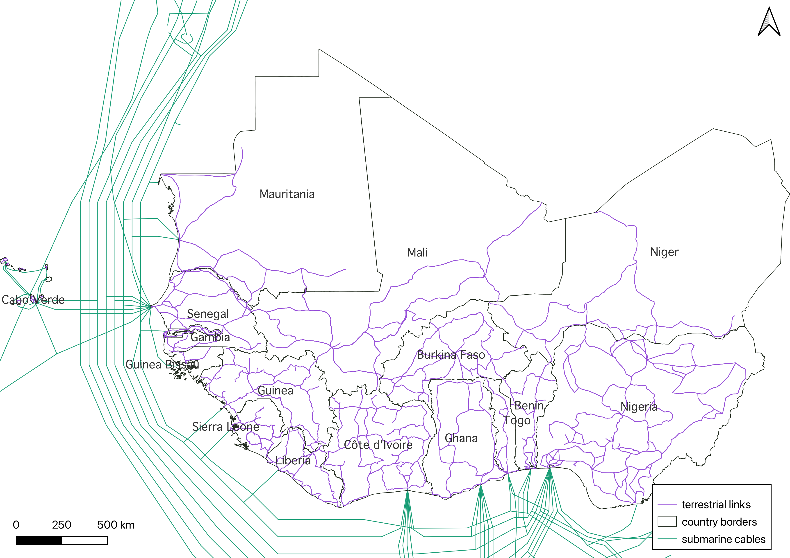

# WATRA Fiber Data

Fiber optic infrastructure data and resources for West African countries collected as part of the WATRA (West Africa Telecommunications Regulators Assembly) Gap Analysis project.

## Overview

This repository contains geospatial data on fiber optic network infrastructure across West Africa, including both operational and planned networks. The data is provided in standardized formats to support regional telecommunications planning and infrastructure development initiatives.

_Figure: Terrestrial and submarine links in West Africa._



The dataset includes fiber infrastructure data for the following West African countries:

- **BEN**: Benin
- **BFA**: Burkina Faso  
- **CIV**: Côte d'Ivoire
- **CPV**: Cape Verde
- **GAM**: Gambia
- **GHA**: Ghana
- **GIN**: Guinea
- **GNB**: Guinea-Bissau
- **LIB**: Liberia
- **MAL**: Mali
- **MRT**: Mauritania
- **NGA**: Nigeria
- **NIG**: Niger
- **SEN**: Senegal
- **SLE**: Sierra Leone
- **TGO**: Togo

## Directory Structure

```
├── lines/              # Fiber optic cable lines (terrestrial links between nodes)
│   ├── BEN_lines.geojson
│   ├── BFA_lines.geojson
│   └── ...
├── nodes/              # Transmission nodes
│   ├── BEN_nodes.geojson
│   ├── BFA_nodes.geojson
│   └── ...
├── raw/                # Original geo-referenced source data files
│   ├── BEN.tif
│   ├── GHA.tif
│   └── ...
├── IXP/                # Internet Exchange Point data
├── submarine/          # Submarine cable data
└── metadata.xlsx       # Information on data sources and data schemas
```

## Methods

### Data collection and preparation

Recent data sources and network maps were identified for each WATRA country through desk research. Source materials included government reports, regulatory documents, telecommunications operator maps, and development bank assessments.

### Georeferencing and digitization

Network maps were georeferenced using the Georeferencer tool in **QGIS 3.40.3-Bratislava**. Reference points were manually inserted to align source images with known geographic coordinates, typically using linear transformation methods. Georeferenced images were overlaid on OpenStreetMap (OSM) base layers during digitization. Two vector layers were created for each country: one for transmission nodes and one for links.

### Network digitization process

- **Nodes**: Transmission nodes were manually digitized as point features.

- **Links**: Transmission links were digitized using two approaches depending on network topology. For links that closely follow existing road infrastructure, the OSM road network was loaded using QuickOSM plugin queries (highway=*). The OD Matrix from Layers as Lines tool from the QNEAT3 plugin was used to calculate shortest paths between transmission nodes along the road network. For point-to-point connections not following roads closely, links were manually digitized.

### Quality control and processing

- Snap geometries to layer: Links were snapped to ensure proper connectivity with transmission nodes
- Split Lines by Points: Links were segmented at each transmission node to create individual link segments
- Join by location: Start and end node identifiers were automatically extracted for each link segment
- Smooth tool: Applied to reduce angular artifacts in digitized lines

### Post-processing and standardization

Post-processing was conducted using **Python 3.11** with the GeoPandas library to:

- Standardize column names and values
- Calculate link distances in meters using geodetic methods
- Export final datasets in GeoJSON format for interoperability

## Data Schema

### Transmission nodes

| Field | Required | Definition | Example |
|-------|----------|------------|---------|
| `node_id` | Yes | Unique node identifier | FN12345 |
| `latitude` | Yes | Geographical latitude in decimal degrees | 38.988755 |
| `longitude` | Yes | Geographical longitude in decimal degrees | 1.401938 |
| `operator_name` | No | Name of the telecommunications operator | TelOperator |
| `infrastructure_type` | Yes | Type of infrastructure: fiber, microwave, other | Fiber |
| `node_status` | Yes | Operational status: Operational, Planned, Under Construction | Operational |
| `equipped_capacity_mbps` | No | Active bandwidth capacity available to subscribers (Mbps) | 1000 |
| `potential_capacity_mbps` | No | Total theoretical bandwidth capacity (Mbps) | 2000 |
| `country` | Yes | Country where the node is located | Nigeria |
| `region` | Yes | Regional classification | ECOWAS |
| `data_source` | Yes | Source organization of original data | NCC |
| `data_source_year` | Yes | Year data was published | 2020 |

#### Terrestrial links

| Field | Required | Definition | Example |
|-------|----------|------------|---------|
| `line_id` | Yes | Unique line/link identifier | FL12345 |
| `operator_name` | No | Telecommunications operator or infrastructure provider | MTN, Orange, Airtel |
| `from` | Yes | Starting node identifier or location name | Lagos |
| `to` | Yes | Ending node identifier or location name | Abuja |
| `distance` | Yes | Physical distance of the link in meters | 5230 |
| `status` | Yes | Operational status: Operational, Planned, Under Construction | Operational |
| `country` | Yes | Country where the link is located | Nigeria |
| `region` | Yes | Regional classification | ECOWAS |
| `data_source` | Yes | Source organization of original data | NCC, World Bank, ECOWAS |
| `data_source_year` | Yes | Year data was published or collected | 2020 |

### Submarine Cables

| Field | Required | Definition | Example |
|-------|----------|------------|---------|
| `name` | Yes | Name of the submarine cable system | ACE (Africa Coast to Europe), MainOne, SAT-3/WASC |
| `capacity_Tbps` | No | Total design capacity in Terabits per second | 40 |
| `year_service` | No | Year the cable entered commercial service | 2020 |
| `length_km` | No | Total length of the cable system in kilometers | 500 |

### Cable Landing Stations

| Field | Required | Definition | Example |
|-------|----------|------------|---------|
| `name` | Yes | Name of the landing station | Accra, Ghana Landing Station |
| `cables_count` | Yes | Number of cables using the landing station | 2 |
| `first_cable_name` | Yes | Name of the primary cable | Africa1 |

### Internet Exchange Points (IXPs)

| Field | Required | Definition | Example |
|-------|----------|------------|---------|
| `name` | Yes | Name of the Internet Exchange Point | BENIN-IX |
| `country` | Yes | Country where the IXP is located | Benin |

**Note:** All geographic coordinates use the WGS84 coordinate system (EPSG:4326) and are provided in decimal degrees.

## Usage

### Loading Data

The GeoJSON files can be loaded into any GIS software or mapping application:

```python
# Example using Python with geopandas
import geopandas as gpd

# Load fiber lines for a specific country
benin_lines = gpd.read_file('lines/BEN_lines.geojson')
benin_nodes = gpd.read_file('nodes/BEN_nodes.geojson')

# Display basic information
print(f"Benin has {len(benin_lines)} fiber connections")
print(f"Benin has {len(benin_nodes)} network nodes")
```

## License

This project is licensed under the MIT License - see the [LICENSE](LICENSE) file for details.

## Metadata

Detailed metadata, including data sources and schemas are available in `metadata.xlsx`.

---